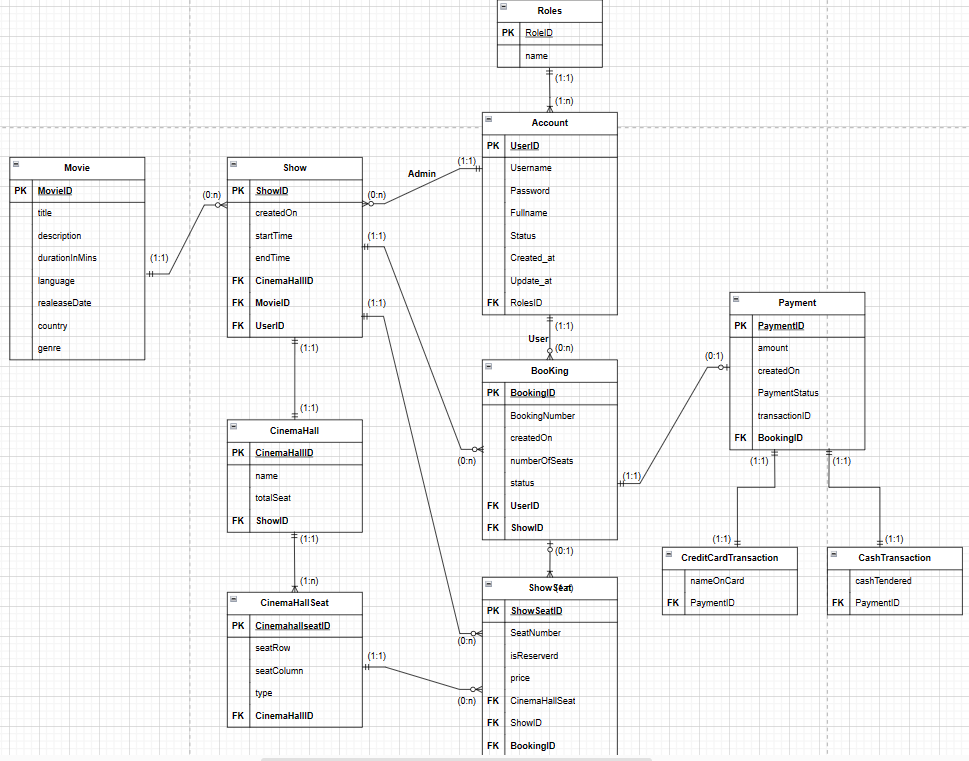
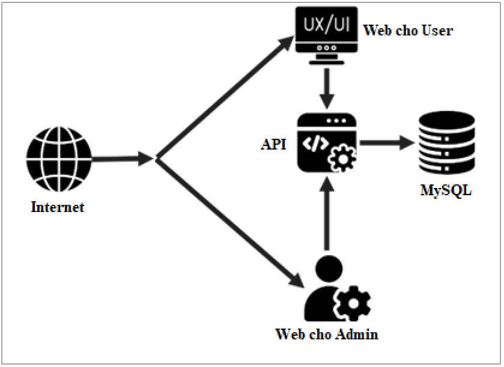
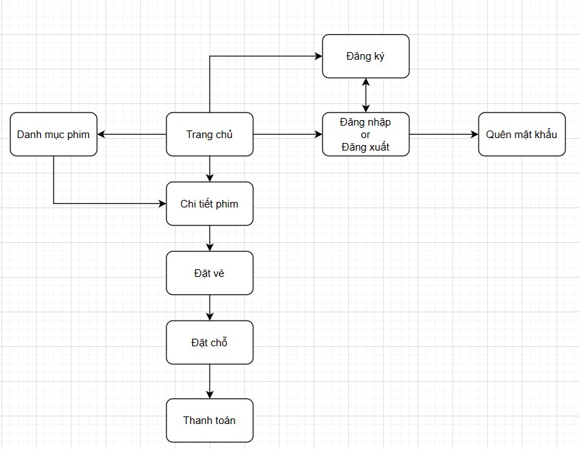
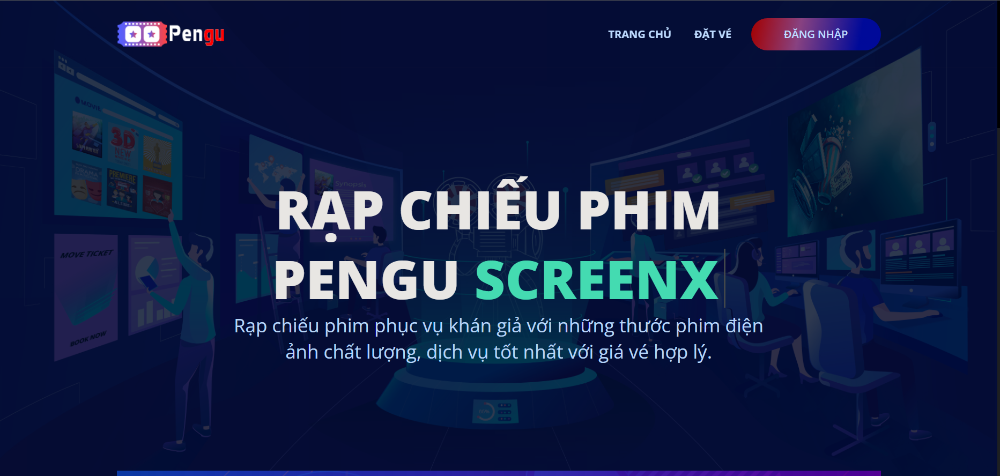
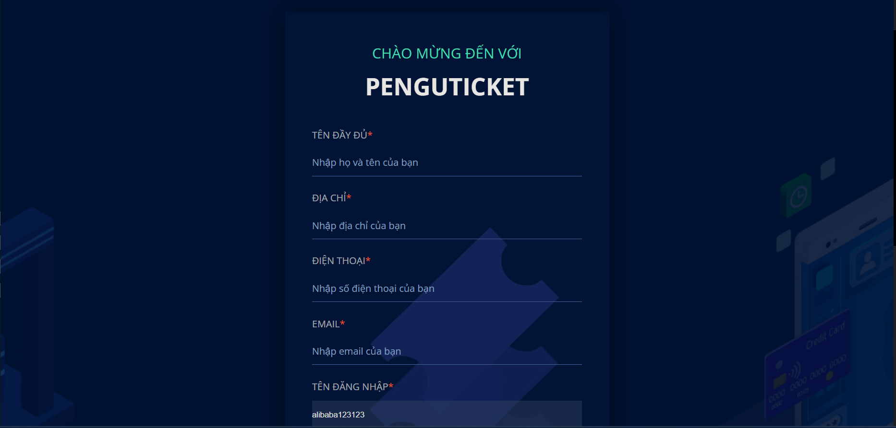
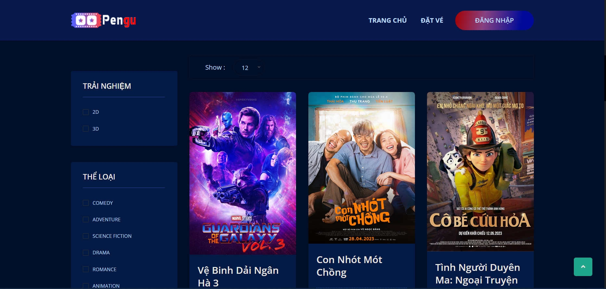
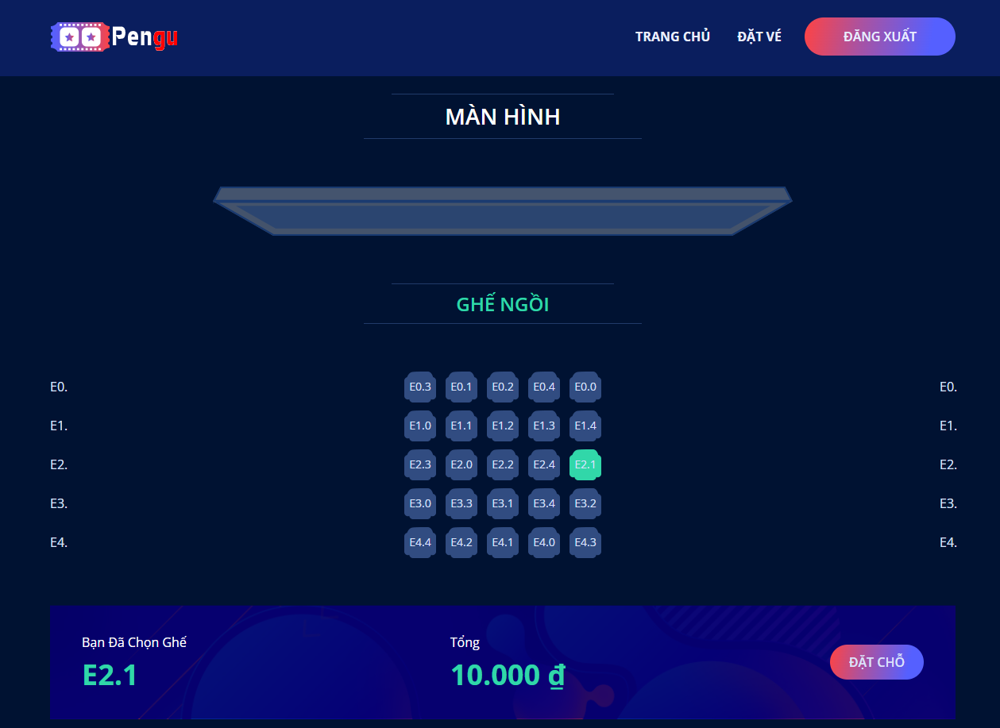
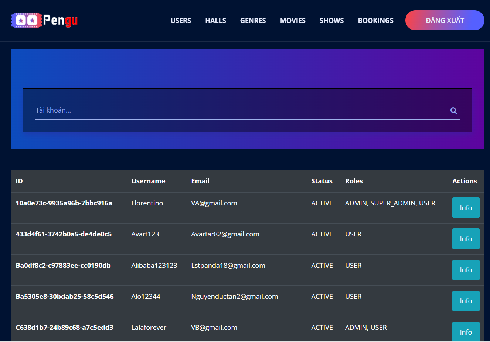

# Video giới thiệu dự án :
https://drive.google.com/file/d/1BYfJVRKD75UAL6c8_RJcxgy0ADqOu9Cs/view?usp=sharing
<br/>
# **1. Tên dự án:**
Website bán vé xem phim sử dụng Java Sping Boot.
<br/>

# **2. Giới thiệu:**
Xây dựng website quản lý bán vé xem phim với các tính năng chính: tìm kiếm phim, đặt vé, chọn suất chiếu và thanh toán.
<br/>

# **3. Thành viên nhóm:**
| Sinh Viên                | MSSV         |
| :----------------------- |:-----------: | 
| Lê Thành Vũ              | 23IT316      |


# **4. Công nghệ:**
- **Database: MySQL **

- **Backend: Restful API**
  - Java 
  - Spring Boot 
  - Maven 
  - JWT (io.jsonwebtoken)

- **Frontend:**
	- HTML
	- CSS
	- JS

- **Khác:**
	- Docker: Cho phép triển khai project nhanh chóng trên các máy tính khác nhau.
	- Nginx: Dựng server cho các web service trong docker.
	- Sandbox của VNPay: Tích hợp ứng dụng thanh toán của VNPAY trong việc đặt vé.
<br/><br/>

# **5. Cài đặt:**
#### Yêu cầu phải máy tính phải cài đặt sẵn `docker` và `docker-compose`
#### Tại thư mục mẹ, gõ lệnh dưới để chạy project:
```shell
docker-compose up --build --no-deps
```
#### Dừng project bằng `Ctrl + C` và gõ lệnh:
```shell
docker-compose down
```
<br/>

# **6. Thông tin:**
### **A. Các Website:**
- Website chính (Front-end): http://localhost:80
	- Hiển thị nội dung liên quan đến phim và cho phép đặt/thanh toán vé.
<br/><br/>
- Website Admin (Front-end): http://localhost:81
	- Trang admin cho phép quản lý các nội dung trên website chính và các user. Yêu cầu tài khoản có quyền `admin` để đăng nhập. 
<br/><br/>
- Website cho API (Back-end): http://localhost:9595
	- Xử lý các request được gửi từ front-end.
    - Xem chi tiết tại http://localhost:9595/swagger-ui/index.html
<br/><br/>
- Website cho Database (Back-end): http://localhost:32346
	- Hiển thị trực quan database của web (dùng [PHPMyAdmin](https://www.phpmyadmin.net/)).
<br/>


# **7. Mô hình hoạt động:**
### &nbsp;&nbsp;&nbsp;&nbsp;&nbsp;**A. Mô hình Database:**
<div align='center'>
	
</div>
<br/>

### &nbsp;&nbsp;&nbsp;&nbsp;&nbsp;**B. Mô hình hoạt động cơ bản:**
<div align='center'>
	
</div>
<br/>

### &nbsp;&nbsp;&nbsp;&nbsp;&nbsp;**C. Mô hình hoạt động của website dành cho User:**
<div align='center'>
	
</div>
<br/>

### &nbsp;&nbsp;&nbsp;&nbsp;&nbsp;**D. Mô hình hoạt động của website dành cho Admin:**
<div align='center'>
	
</div>
<br/><br/>

# **8. Chức năng của trang web:**
### **A. Chức năng của User:**
- Đăng ký
	+ Xác thực tài khoản qua email
- Đăng nhập
- Đăng xuất
- Quên mật khẩu
	+ Xác nhận mật khẩu mới qua email
- Tìm kiếm phim theo từ khóa, thể loại
- Đặ̣t vé:
	+ Lựa chọn suất chiếu(ngày, giờ, phòng chiếu)
	+ Chọn chỗ ngồi
	+ Thanh toán (VNPAY, QR Code, Thẻ Nội Địa, Thể Quốc Tế) i
    	* Gửi vé điện tử và chi tiết thanh toán qua email khi thanh toán thành công.

### **B. Chức năng của Admin:**
- Quản lý user.
- Thêm, xóa, sữa dữ liệu liên quan đến các suất chiếu phim như: phim chiếu, lịch chiếu, phòng chiếu, số lượng ghế và lưu lại thông tin thanh toán.
<br/><br/>

# **9. Bảo mật:**
### Sử dụng JWT (JSON Web Token) để phân quyền truy cập và xác thực user.
### Cấu trúc của token:
#### &nbsp;&nbsp;1. Thuật toán sử dụng: `RS256` với key có kích thước `2048 bit`
#### &nbsp;&nbsp;2. Loại data có trong token bao gồm:
- `roles` : Dùng để phân quyền người dùng, bao gồm `SUPER_ADMIN`, `ADMIN`, `USER` 
- `sub` : Chứa username của người dùng.
- `iat` : Lưu thời điểm tạo token.
- `exp` : Lưu thời điểm hết hạn của token (sau 1 giờ kể từ lúc tạo)

<br/>

# **10. Demo:**
## **10.1. Website cho User:**

### &nbsp;&nbsp;&nbsp;&nbsp;&nbsp;**A. Trang Chủ**
<div align='center'>
	
</div>
</br>

### &nbsp;&nbsp;&nbsp;&nbsp;&nbsp;**B. Đăng nhập/đăng ký User:**
<div align='center'>
	
	<br>
	
</div>
</br>

### &nbsp;&nbsp;&nbsp;&nbsp;&nbsp;**C. Trang chọn phim**
<div align='center'>
	
</div>
</br>

### &nbsp;&nbsp;&nbsp;&nbsp;&nbsp;**D. Trang chi tiết phim:**
<div align='center'>
	
</div>
</br>

### &nbsp;&nbsp;&nbsp;&nbsp;&nbsp;**E. Trang chọn giờ xem:**
<div align='center'>
	
</div>
</br>

### &nbsp;&nbsp;&nbsp;&nbsp;&nbsp;**F. Trang Chọn ghế:**
<div align='center'>
	
</div>
</br>

### &nbsp;&nbsp;&nbsp;&nbsp;&nbsp;**G. Trang thanh toán:**
<div align='center'>
	
</div>
</br></br>

## **10.2. Website cho Admin:**
### &nbsp;&nbsp;&nbsp;&nbsp;&nbsp;**A. Đăng nhập Admin:**
<div align='center'>
	
</div>
</br>

### &nbsp;&nbsp;&nbsp;&nbsp;&nbsp;**B. Admin quản lý tài khoản:**
<div align='center'>
	
</div>
</br>

### &nbsp;&nbsp;&nbsp;&nbsp;&nbsp;**C. Admin thêm suất chiếu:**
<div align='center'>
	
</div>
</br></br>

## **10.3. Website cho API:**
### &nbsp;&nbsp;&nbsp;&nbsp;&nbsp;**Trang API document:**
<div align='center'>
	
</div>
</br></br>

